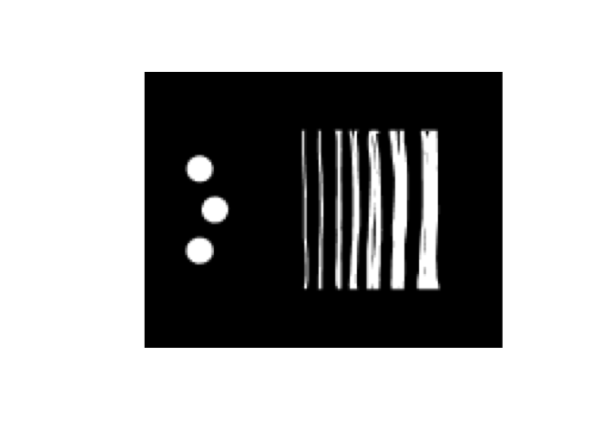

<!-- README.md is generated from README.Rmd. Please edit that file -->

# enRich

<!-- badges: start -->
<!-- badges: end -->

enrichR is a simple R package designed to interface with the Local
Contexts Hub API.

## Installation

You can install the development version of enRich from
[GitHub](https://github.com/) with:

``` r
# install.packages("devtools")
devtools::install_github("jacobgolan/enRich")
```

# Getting started

Install and load `enRich`

``` r
library(enRich)
library(dplyr)
#> 
#> Attaching package: 'dplyr'
#> The following objects are masked from 'package:stats':
#> 
#>     filter, lag
#> The following objects are masked from 'package:base':
#> 
#>     intersect, setdiff, setequal, union
```

`enRich` is a simple and easy to use package. Here is an index of its
key functions:

``` r
?index.all.projects() # create a table of all projects in the LC Hub

?find.project.id() #search for a project's unique ID

?find.projects() #find and retrieve projects' metadata, notices and TK/BC labels

?readFASTA() #import a FASTA file into R

?outputFASTA() #export a FASTA file from R

?testFASTA() #create a dummy FASTA for learning
```

# **Step 1**: Importing Sequences

The function `testFASTA()` allows us to create a dummy FASTA for
testing. You must specify the following arguments:

``` r
testFASTA(
  seqlength = c(75,100), # minimum and maximum sequence length range
  DNA_prob = rep(0.25,4), # relative freq of A, T, G, C
  no_seqs = 10, # how many sequences to simulate
  out.fasta = TRUE, #TRUE if you want to save a .fasta file to your computer
  file_name = "dsi", #only specify if out.fasta=TRUE
  loc = "LocusX" # locus name
)
```

When working with real data you will likely need to import a file from
your computer into R. This can be done easily using `readFASTA()`

For simplicity, we will just read in the dummy FASTA we just created
with `testFASTA()`. But in practice you can read in an FASTA file
downloaded from NCBI, custom created, etc.

``` r
dsi<-readFASTA("dsi.fasta")
```

Running either `testFASTA()` or `readFASTA()` results in a dataframe
with two columns. The first column is the sequence name (header) and the
second column is the sequence itself. For example, if we run
`print(dsi)` we can see how sequences are stored:

``` r
#               seqid                                                                                               seqstr
# 1   Sample_1_LocusX      GTCTGGCGTATGTCATAGACCGTAAACTCTTCTACCCCCTTCTAGACATATGTTGCGACACCCTACGGCACTGTCTGGATGAGGGCCACGAAAGG
# 2   Sample_2_LocusX          GCACACCGCTGTGCGTGTTCTTTCATCGAATGCTGAGATCCCTCGAAGTTGCCCTGCCAAAGCGTGCCCCACCTACCCCTAGTGTGACAAT
# 3   Sample_3_LocusX   AAAGTCAATTGTTCAGTCTACCCCCTGCTGTTGGTCGTTGAGTTACTTTGATAGTGGAGATGTACGGCAATAAGTGTCATTGTATGATAACGAGCTAG
# 4   Sample_4_LocusX                       AATGCCTGAGCAAGGATCGATGAAGGACCCAATAGACTCGGCAACGACCCGGGATTCTACCCACACATCCTGTGGGTT
# 5   Sample_5_LocusX                 TTCATCTTTCACCCAAGTAAATGGTAAATGTAGCATCTTGCAACTTTATCTTGAGTGGCGAGGTATATGCAGTGTTGTTTTTGC
# 6   Sample_6_LocusX           GTGAGGGTACTATTCGAGGTTCAACAATCGCGAGCCGCTTCAGCCCCAGCAATCCCGTTTGGGAGCGACTCGCGCTCGGGAAGATAGCGA
# 7   Sample_7_LocusX                         AAGCCCGTCTTATTCGCATCAAACCAAGCGAATTTACTGGTTCACGCATCATTCTGGTCATGCGAGTCCTGAACTA
# 8   Sample_8_LocusX     ACTCTTGCGCGGCGAGAATTTCTGGTGCAGTGCGGAGAAGCACAGCCCAACCCGTCCTCCGTAAAATGTACAGTAGGGGTAGTGGTTTCTTCGCTC
# 9   Sample_9_LocusX TAAGGGCAGGCAGATTACACTCCAAAAGAGATGTGTACAGCCTTGCAGCTTCTCCCTCGCCGTAACTACAGATGGAGCCCATGTGCGCCCACTTGATCCT
# 10 Sample_10_LocusX  GATGGCGCGAAAGAGCTGGGAATTCAAACGCGCAAATCACCACTGACTGTCAGTTCAACTGAAAGGCCTAAAAGCGATGACTAATGCGATAGGCTCAAA
```

# Step 2: Find Project Data

`ernRich` allows you to index all of the projects in the LC Hub. You can
also search by unique ID, or if you are unsure of the uniqe ID, you can
find it by searching for matching titles, etc.

To start, let’s say we already know the unique ID of the project we are
interested in:

``` r
sample.proj<-find.projects("259854f7-b261-4c8c-8556-4b153deebc18")
lapply(sample.proj, names)[[1]]
#>  [1] "unique_id"                "providers_id"            
#>  [3] "project_page"             "title"                   
#>  [5] "project_privacy"          "date_added"              
#>  [7] "date_modified"            "created_by"              
#>  [9] "bc_labels"                "tk_labels"               
#> [11] "project_boundary_geojson"
#> [1] "unique_id"                "providers_id"            
#> [3] "title"                    "project_privacy"         
#> [5] "date_added"               "date_modified"           
#> [7] "bc_labels"                "tk_labels"               
#> [9] "project_boundary_geojson"
```

By searching by a project’s unique ID we get to all the project
metadata. Above displays all of the metadata fields.

``` r
sample.proj[[1]]$unique_id #displays the unique ID we searned for
#> [1] "259854f7-b261-4c8c-8556-4b153deebc18"
#> [1] "259854f7-b261-4c8c-8556-4b153deebc18"
sample.proj[[1]]$providers_id
#> NULL
#> NULL
sample.proj[[1]]$title # project title
#> [1] "Sample Project"
#> [1] "Sample Project"
sample.proj[[1]]$project_privacy # project privacy
#> [1] "Public"
#> [1] "Public"
sample.proj[[1]]$date_added
#> [1] "2021-10-22T18:15:41.507481Z"
#> [1] "2021-10-22T18:15:41.507481Z"
sample.proj[[1]]$date_modified
#> [1] "2022-07-19T22:46:08.582871Z"
#> [1] "2021-10-22T18:15:41.507513Z"
```

We can also see that there are fields in sample.proj for BC and TK
labels

``` r
sample.proj[[1]]$bc_labels %>% names()
#>  [1] "unique_id"    "name"         "label_type"   "language_tag" "language"    
#>  [6] "label_text"   "img_url"      "svg_url"      "audiofile"    "community"   
#> [11] "translations" "created"      "updated"
#>  [1] "name"         "label_type"   "language_tag" "language"     "default_text"
#>  [6] "img_url"      "svg_url"      "community"    "translations" "created"     
#> [11] "updated"
sample.proj[[1]]$tk_labels %>% names()
#>  [1] "unique_id"    "name"         "label_type"   "language_tag" "language"    
#>  [6] "label_text"   "img_url"      "svg_url"      "audiofile"    "community"   
#> [11] "translations" "created"      "updated"
#>  [1] "name"         "label_type"   "language_tag" "language"     "default_text"
#>  [6] "img_url"      "svg_url"      "community"    "translations" "created"     
#> [11] "updated"
```

There are many ways to parse the image files associated with TK and BC
labels. Below is just one example of how to do so. You can see a BC
Provenance label is displayed. All we had to do was specify the uniquqe
ID and the API will take care of the rest!

``` r
plot(imager::load.image(sample.proj[[1]]$bc_labels$img_url),axes=FALSE)
```

 But
what happens if you don’t know the unique ID for a project? We can still
find it!

``` r
tmp<-index.all.projects() # Import a table of all Hub projects
id.search.out<-find.project.id(tmp, title="Two") #Search for projects with the word 'Two' in their title
```

Looks like there is one project that matches our criterion.

``` r
UQID<-as.character(id.search.out$unique_id)
```

Gets us the unique ID of the project we were looking for!

# Step 3: Appending Unique IDs to our Sequences

Now that we know the relevant unique ID, we can append it to our FASTA
headers. We will use the FASTA we read in before in Step 1.

``` r
outputFASTA(
  seqs = dsi$seqstr,
  seqid = dsi$seqid,
  uqID = UQID, # the uniqe ID for the project we found above in Step 3
  filename = "dsi.with.hub.metadata" # .fasta is automatically added
)
```

Now we can see a project’s unique ID has been appended to the headers of
al of our sequences! These seqeunces can now we deposited anywhere with
the appropriate provenence data easily parsed from each sequence’s
unique ID string.
